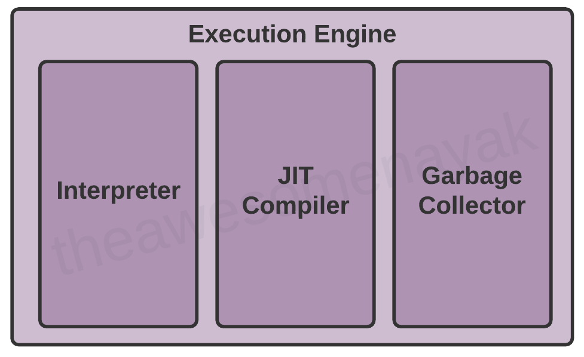

# JVM Architecture

A Java application runs over a virtual machine, the JVM. A *virtual machine* is a virtual representation of a physical
machine. Therefore, the JVM makes it possible the WORA (Write once, run anywhere) approach.  

## But... How is this possible?

Let's see the short explanation.

In programming languages like C and C++, the code is first compiled into platform-specific machine code. These are
*compiled languages*.

On the other hand, in languages like JavaScript and Python, each line of code is executed directly on the computer.
These are *interpreted languages*.

Java uses a combination of both techniques. The source code, from a *java file*, is first **compiled** into *byte code*
to generate a *class file*. Then *byte code* instructions of the *class file* are **interpreted** by the JVM for the
underlying platform. So, the same *class file* can be executed on different platforms, which obviously, have a
compatible JRE.  
 

> **Now the JVM is not Java exclusive!**  
> 
> The JVM was initially designed to support only Java. However, over time, many other languages such as Scala, Kotlin,
> and Groovy run on the JVM. All of these languages are collectively known as JVM languages.

 
We can deduce that the JVM contains an interpreter, but it isn't so simple. Below we'll analyze the different
components that compose the JVM.

## Which are the components of the JVM?

The JVM consists of three main components:

1. Class Loader
2. Runtime Data Areas
2. Execution Engine

## The Class Loader component
The Class Loader component is responsible for the class loading process. The class loading process has three phases: 
**loading**, **linking**, and **initialization**. 

When a Java application uses a type (class, interface, enum, etc) for the first time, the Class Loader component
performs a class loading process. 

### Loading phase
The loading phase involves looking for a required type based on its *binary name*, and if was found, taking its bytecode
representation and creates its representation as a `java.lang.Class` instance.  
 

> **What is the binary name of a type?**
> 
> Any type name provided as a `String` parameter to methods in `ClassLoader` must be a *binary name* as defined by
> The Java™ Language Specification. Examples of valid class names include:
> 
> - "java.lang.String" -> The binary name of a top level type is its canonical name.
> - "javax.swing.JSpinner$DefaultEditor" -> The binary name of an inner class.
> - "java.security.KeyStore$Builder$FileBuilder$1" -> The binary name of an anonymous class.
> 
> According to the `java.lang.Class` documentation, the instances of this class represent a type (class, interface,
> enum, annotation, arrays, and even the Java primitive types and the keyword `void`). 
>   
> The class `Class` has no public constructor, instead, `Class` objects are constructed by the JVM during the
> loading phase with a call to method `ClassLoader.defineClass`.
> 
> Every `Class` object contains a reference to the `ClassLoader` object that defined it.

 
For the loading phase, the JVM uses a parent-delegation model and a hierarchy of three built-in class loaders.  

The parent-delegation model states that any request for a class loader to load a given type is first delegated to
its parent class loader, and so on until reaching the hierarchy's root class loader. If the hierarchy's root class
loader finds the requested type, then loads it and returns it; otherwise transfers the control to the class loader
below on the hierarchy, which repeats the same process: loads the type successfully or transfers the control to the
"child" class loader in otherwise. If the originally requested class loader cannot load the type it throws 
`NoClassDefFoundError` or `ClassNotFoundException`.  
 
  
  
 

> **What is the difference between `NoClassDefFoundError` and `ClassNotFoundException`?**
>
> - **NoClassDefFoundError**  
> This **error** is thrown when a type was present at compile time, but it's not present at runtime.  
> 
> - **ClassNotFoundException**  
> This **checked exception** is thrown when you try to load a class using its fully qualified name (with the methods
> `Class.forName`, `ClassLoader.loadClass` or `ClassLoader.findSystemClass`) and the required class cannot be found.

 
The three built-in classloaders are explained below:  
  

- **Bootstrap Class Loader**  
  This is the hierarchy's root class loader and is implemented in languages like C or C++. It's the parent class loader
  of *Extension Class Loader*. The *Bootstrap Class Loader* is responsible for loading types that belong to the standard
  libraries of Java (Java SE API). These libraries are present in the `$JAVA_HOME/jre/lib` directory.  
   
- **Extension Class Loader**  
  The *Extension Class Loader* is implemented with Java and is the parent class loader of *Application Class Loader*.
  This class loader is responsible for loading types from "extensions" of the standard libraries of Java. Any *jar* in
  the `$JAVA_HOME/jre/lib/ext` directory is treated as an extension.  
   
- **Application Class Loader**  
  The *Application Class loader* is implemented with Java and is responsible for loading types from the application
  classpath.

 

### Linking phase
This phase comes after the loading phase. The linking phase performs **verification**, **preparation**,
and (optionally) **resolution**.  

- **Verification**  
  This activity is done by the *ByteCode Verifier* and ensures the correctness and security of the bytecode inside a 
  *class* file. If verification fails a `java.lang.VerifyError`is thrown.  
  
  For example, if the code was built with Java 11, but trying to run on a system that has Java 8, the verification
  will fail.  
  
- **Preparation**  
  The JVM allocates memory for statics fields and assigns default values to them.  
  
- **Resolution**  
  In this activity the symbolic references are replaces with direct references.

 

### Initialization phase
This is the last phase of the class loading process. In this phase, all static variables are assigned with their values
defined in the code and static blocks are executed.  

 

## Runtime Data Areas
This component groups the different runtime data areas (memory spaces) that are used during the execution of a program.
Some of these data areas are created on JVM startup and are destroyed only when the JVM exits. Other data areas are per
thread. Per thread data areas are created when a thread is created and destroyed when the thread exits.

The following diagram shows the five runtime data areas of a JVM:

> **Wait a minute... The JVM specification defines six runtime data areas, what's going on here?**
>
> The JVM specification defines the **Runtime Constant Pool** data area. This is a per-class or per-interface data area
> that works as a runtime representation of the `constant_pool` table in a *class file*.
>
> Also, the JVM specification states that each **Runtime Constant Pool** is allocated from the **Method Area**.
> That's why the **Runtime Constant Pool** is considered as part of the **Method Area**.  

 

### Method Area
The Method Area is created on JVM startup and is shared among all the threads. It stores per-class / per-interface
structures such as the **Runtime Constant Pool**, field and method data, and the code for methods and constructors,
including special methods (created by the compiler, we talk about them in another article) used in class and instance
initialization and interface initialization.  
 

> **Quote about the Method Area in the JVM specification**
>
> *"Although the method area is logically part of the heap, simple implementations may choose not to either garbage
> collect or compact it. This specification does not mandate the location of the method area or the policies used to
> manage compiled code. The method area may be of a fixed size or may be expanded as required by the computation and
> may be contracted if a larger method area becomes unnecessary. The memory for the method area does not need to be
> contiguous."*

 

If the memory in the Method Area cannot be available to satisfy an allocation request, the JVM throws an 
`OutOfMemoryError`.  
 

> **Are PermGen or Metaspace implementations of Method Area**?
> 
> There is a lot of "information" on the internet, but I have not found any trusted source, so, this a pending topic. 

 

### Heap Area
The Heap is created on JVM startup and is shared among all the threads. The Heap is the runtime data area (memory space)
from which memory for all objects (class instances and arrays) is allocated.  
 

> **Quote about the Heap in the JVM specification**
>  
> *"Heap storage for objects is reclaimed by an automatic storage management system (known as a garbage collector);
> objects are never explicitly deallocated. The Java Virtual Machine assumes no particular type of automatic storage
> management system, and the storage management technique may be chosen according to the implementor's system
> requirements. The heap may be of a fixed size or may be expanded as required by the computation and may be contracted
> if a larger heap becomes unnecessary. The memory for the heap does not need to be contiguous."*

 

If a computation requires more Heap that can be made available by the *Garbage Collector*, the JVM throws an
`OutOfMemoryError`.

   

### Stack Area
The Stack is a per-thread runtime data area, which means that when the JVM creates a new thread, also creates one Stack
for that thread. A Stack is a private memory space for one, and just one thread, and stores the method calls (and all 
related with each method call, like local variables and partial results) performed by the task associated with the
thread.  
 

> **Thread and Stack official names**  
> 
> In the JVM specification these are the official names for a thread and a stack:
> 
> - **Thread** -> *Java Virtual Machine thread*  
>   This makes sense to differentiate them from the operating system's threads.  
> 
> - **Stack** -> *Java Virtual Machine stack*

 

As the name implies, the Stack has a *LIFO* behavior, where each element of the Stack is called a *frame* and corresponds
to a method call.

 

> **Quotes about the Stack in the JVM specification**
> 
> *"The memory for a Java Virtual Machine stack does not need to be contiguous."*
> 
> *"This specification permits Java Virtual Machine stacks either to be of a fixed size or to dynamically expand and
> contract as required by the computation. If the Java Virtual Machine stacks are of a fixed size, the size of each
> Java Virtual Machine stack may be chosen independently when that stack is created."*

 

If a computation in a thread requires a larger Stack than is permitted, the JVM throws a `StackOverflowError`.

If a Stack can be dynamically expanded, and expansion is attempted but insufficient memory can be available to
perform the expansion, or if insufficient memory can be made available to create the Stack for a new thread,
the JVM throws an `OutOfMemoryError`.

 

### PC Register
The PC Register is a per-thread runtime data area, which means that a thread has its own PC (program counter) Register.
At any point, each thread is executing the code of a single method, namely the current method (the method call at the
top of the stack). If the current method is not *native*, the PC Register contains the address of the JVM instruction
currently being executed. If the current method is *native*, the value of the PC Register is undefined. 

 

> **Quote about the PC Register in the JVM specification**
>
> *"The Java Virtual Machine's pc register is wide enough to hold a `returnAddress` or a native pointer on the
> specific platform."* 

 

### Native Method Stack
The Native Method Stack, as its name implies, is used to support calls to *native* methods (written in languages
such as C or C++). Typically, a Native Method Stack is allocated when a thread is created, therefore is a per-thread
runtime area.

 

> **Quotes about the Native Method Stack in the JVM specification**
>
> *"Native method stacks may also be used by the implementation of an interpreter for the Java Virtual Machine's
> instruction set in a language such as C. Java Virtual Machine implementations that cannot load native methods and
> that do not themselves rely on conventional stacks need not supply native method stacks."*
> 
> *"This specification permits native method stacks either to be of a fixed size or to dynamically expand and contract
> as required by the computation. If the native method stacks are of a fixed size, the size of each native method stack
> may be chosen independently when that stack is created."*

 

If a computation in a thread requires a larger Native Method Stack than is permitted, the JVM throws a 
`StackOverflowError`.

If a Native Method Stack can be dynamically expanded, and expansion is attempted but insufficient memory can be
available to perform the expansion, or if insufficient memory can be made available to create the Native Method Stack
for a new thread, the JVM throws an `OutOfMemoryError`.

 

## Execution Engine
The Execution Engine component is responsible for running the application. To run an application, the Execution Engine
component executes bytecode instructions, uses data stored in runtime data areas, and runs the garbage collection
process as needed.

Executing bytecode instructions involves translating them to the physical machine's instructions, and this generates an
overhead. For performance improvement, the Execution Engine determines when uses the *Interpreter* or the
*JIT Compiler*.

### Interpreter
The interpreter reads and executes the bytecode instructions line by line. A disadvantage of the interpreter is that
when one method is called multiple times, every call requires a new interpretation.  
 

### Bibliography  
- https://www.freecodecamp.org/news/jvm-tutorial-java-virtual-machine-architecture-explained-for-beginners/
- https://www.ibm.com/docs/en/sdk-java-technology/7.1?topic=uc-class-loading
- https://www.geeksforgeeks.org/jvm-works-jvm-architecture/  
- https://dzone.com/articles/java-classnotfoundexception-vs-noclassdeffounderro
- https://docs.oracle.com/javase/tutorial/ext/basics/install.html
- https://blogs.oracle.com/sundararajan/understanding-java-class-loading
- https://blogs.oracle.com/sundararajan/jvm-talks
- https://docs.oracle.com/javase/8/docs/api/java/lang/Class.html
- https://docs.oracle.com/javase/8/docs/api/java/lang/ClassLoader.html
- https://docs.oracle.com/javase/specs/jvms/se8/html/jvms-2.html
- https://stuefe.de/posts/metaspace/what-is-metaspace/ (TO READ)
