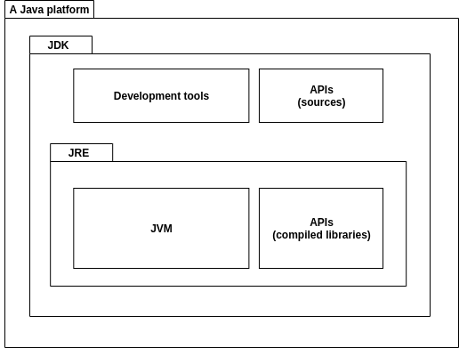
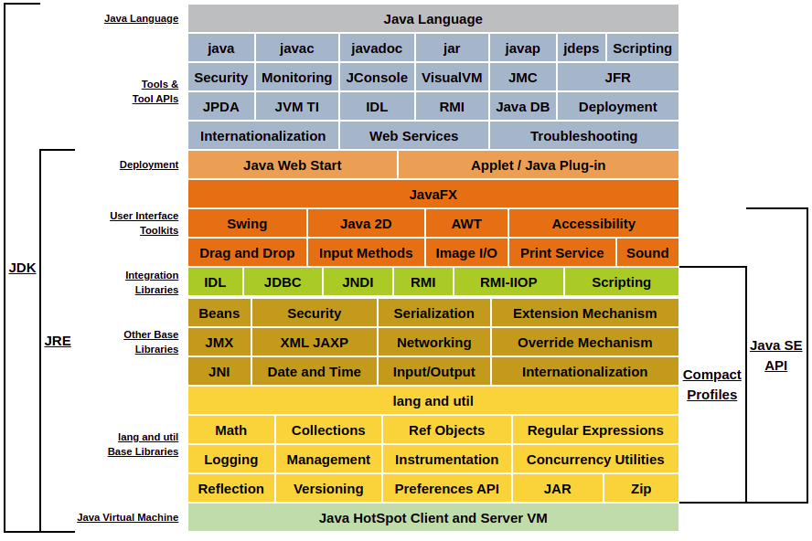

# What is Java?

Java is a technology that is both:  

- A high-level object-oriented language.
- A platform. A Java platform is an environment for developing and/or running Java applications.

There are four Java platforms, that we'll explain them later.  

### How is composed a Java platform?

All Java platforms consists of:

- **JDK**: The Java Development Kit, aka JDK, is a superset of the JRE (Java Runtime Environment), plus development
  tools (such as compiler and debugger) and the sources of the libraries that compose the APIs of the platform.
- **JRE**: The Java Runtime Environment, aka JRE, allows run applications written for a specific Java platform,
  and it's conformed by the JVM and the compiled libraries of the platform's APIs.
- **JVM**: The JVM or Java Virtual Machine, as the name suggests, is a virtual machine implemented according to
  specification that states the rules and minimum guarantees for running applications written in the Java programming 
  language and delivers the advantages of this programming language: portable, multithreaded, dynamic.
  A Java Virtual Machine is written for a particular hardware and operative system.

### Which are the existing Java platforms?

Exists four Java platforms:

- **Java SE**  
  The Java Standard Edition platform (Java SE), contains the API that provides the core functionality of the
  Java programming language.
- **Java EE**  
  The Java Enterprise Edition platform (Java EE), is built on top of the Java SE platform. The Java EE platform
  provides an API and runtime environment for developing and running large-scale, multi-tiered, scalable, reliable, 
  and secure network applications.
- **Java ME**  
  The Java Mobile Edition platform (Java ME) provides an API and a small-footprint virtual machine focus on small
  devices, like mobile phones. The API is a subset of the Java SE API, along with specialized libraries for mobile
  development.
- **JavaFX**  
  The JavaFX platform is oriented to develop desktop applications. Since Java SE 6 Update 6, JavaFX was part of the
  Java SE, however, since Java SE 11 it is a separated module.

 
Below there is a conceptual diagram of JDK for Java SE 8:

### Bibliography  
- https://docs.oracle.com/javaee/6/firstcup/doc/gkhoy.html
- https://docs.oracle.com/javase/8/docs/index.html
- https://docs.oracle.com/javase/tutorial/getStarted/intro/definition.html